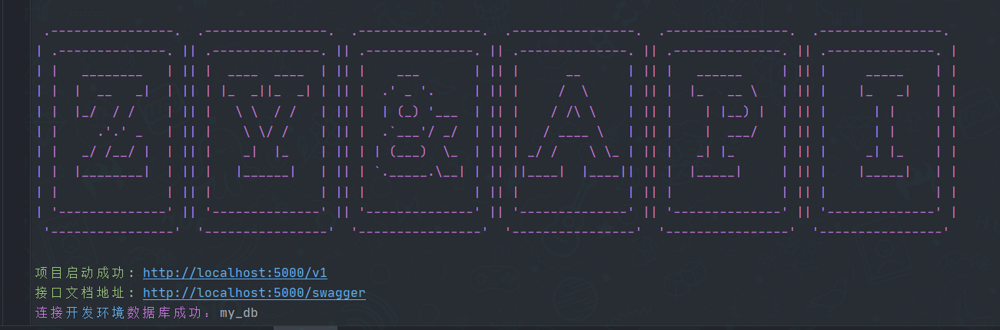

# ZY.Node.Mongodb

- 基于 Node.js、Express.js 和 MongoDB 通过Mongoose驱动进行 REST API 开发的轻量级样板。集成了Swagger UI、JWT、session、发送邮箱验证、日志管理、统一的预定义状态码响应格式等，对于为前端平台构建纯净的Web API非常有用。。

- 该项目我尝试做出轻松维护代码结构的项目样板，因为任何初学者也可以采用该流程并开始构建API。 

- 项目开放，可以提出建议、错误的issues 和 pr 一起优化。

#### 作者

---

- [@ZY_GITEE](https://gitee.com/Z568_568)
- [@ZY_GITHUB](https://github.com/ZHYI-source)

#### 项目特点

---

- 轻量级Node.js项目提供Restful API
- 数据库采用 Mongodb, 通过Mongoose驱动。
- CRUD操作示例
- 跨域处理
- 日志管理
- 具有恰当的状态代码的预定义响应结构
- 全局错误处理
- 增加express-validator请求参数校验
- jwt验证 用户权限中间件分离
- 基本身份验证（采用bcrypt单向Hash加密算法加密密码进行注册/登录）
- Token生成和校验请求头的authorization 
- 集成swagger-ui
- 增加邮件验证码通知
- session 验证码校验


#### 获得并运行项目：

---

> 首先确保您系统中安装了[Mongodb](http://www.mongodb.org/)，和[Nodejs](http://nodejs.org/ "Nodejs")，一起准备完善之后。按照如下操作。
> 有的同学启动会报错可能是依赖包的版本问题需要注意
> 我的环境配置供参考 
> - Node.js 14.18.1+ 
> - MongoDB 5.1+

**1，clone代码**

 >  `git clone https://gitee.com/Z568_568/node.mongodb.git`
 
**2，安装依赖**

 >  `npm install`

**3，启动程序**

 >  `开发环境：npm run dev  基于 nodemon 热更新`
 >  `生产环境：npm run start`

**4，启动成功示例**



#### 项目结构

---

```sh
.
├── app.js                  //入口文件
├── package.json            //依赖配置文件
├── .env.development        //开发环境配置
├── .env.production         //生产环境配置
├── config                  //项目配置
│   ├── db.config.js
│   ├── swagger.config.js
│   └── ...
├── controllers             //控制模块（业务处理）
│   └── v1
│       ├── UserController.js
│       └── ...
├── models                  //模型模块（建表）
│   └── v1
│       ├── index.js        /模型统一导出
│       └── mapping
│           ├──UserModel.js
│           └── ...
├── routes                  //路由（配置实际API地址路径）
│     └── v1
│         ├── index.js
│         ├── user.js
│         └── ...
├── db                      //mongodb数据库连接
│   ├── index.js              
│   └── ...
├── middlewares             //中间件
│   ├── jwt.js
│   ├── permissions.js
│   ├── session.js
│   └── ...
├── logs                    //日志
│   ├── info.log
│   ├── error.log
│   └── ...
└── utils                   //辅助工具
    ├── utils.apiResponse.js
    ├── utils.mailer.js.js
    └── ...
```

#### License

---

[MIT](https://choosealicense.com/licenses/mit/)


 
